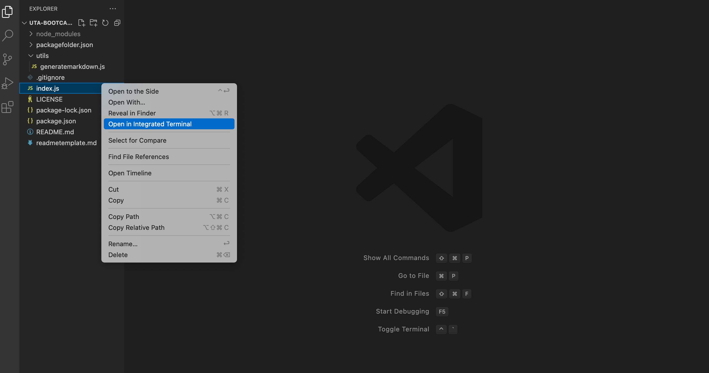
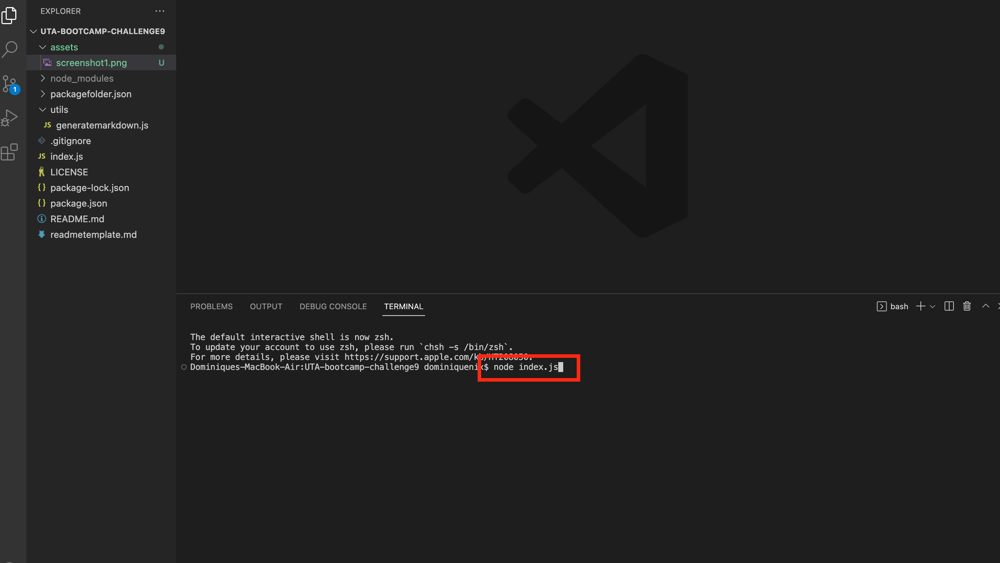
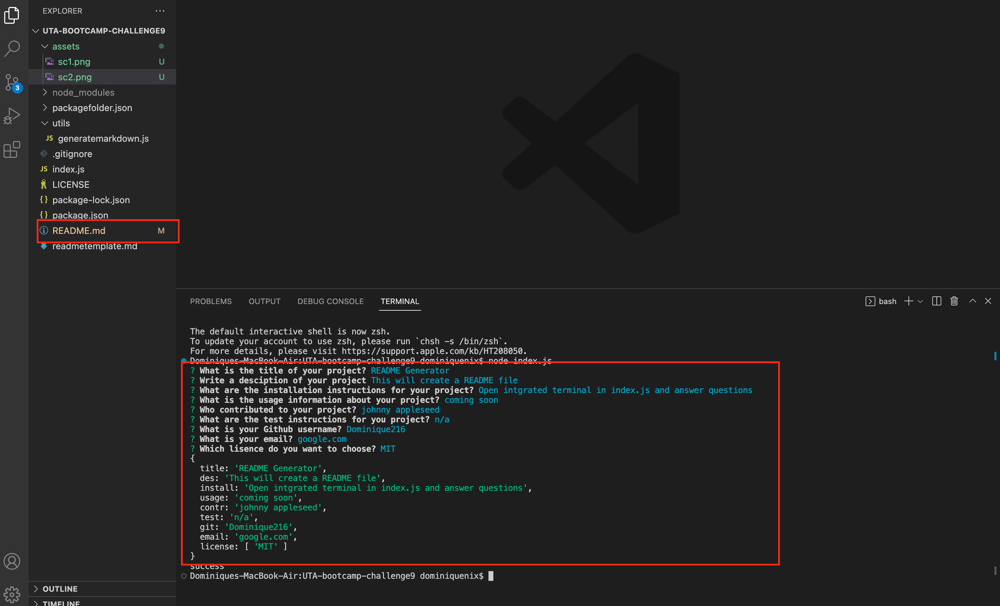

# Readme-Generator
## Description 
This project will generate a README file for any application you want to launch. Using node, it will prompt the user to answer questions that will fill in a template README file with all of the users input. 
## Table of Contents
- [Installation](#installation)
- [Usage](#usage)
- [Credits](#credits)
- [License](#license)
## Installation
1. Copy the SSH key from the Repo into a folder on your own computer
2. Once the files are installed, open the folder in your personal workspace
3. Open the intergrated terminal on the index.js file
4. Run node index.js in the terminal
5. From there you should be prompted in the terminal to answer ten different questions based on what criteria should be in a README file. Those questions will pertain to the propject title, a description, installation inscructions, usage, contributions, test instructions, your GitHub username, email, the best way to contact you, and the type of license used. 
6. Once the questions are answered, a new file will appear named README.md
## Usage
[ Click to watch Walkthrough Video](https://drive.google.com/file/d/1DvMxRveh0d-oQ38HYtxSjZZxGtG0XZMo/view?usp=sharing)

 
 
 
## Credits
For the Markdown License Badges and Links: [lukas-h](https://gist.github.com/lukas-h/2a5d00690736b4c3a7ba)
## License
This project uses an MIT license. For more information click the license badge at the top of the README.
